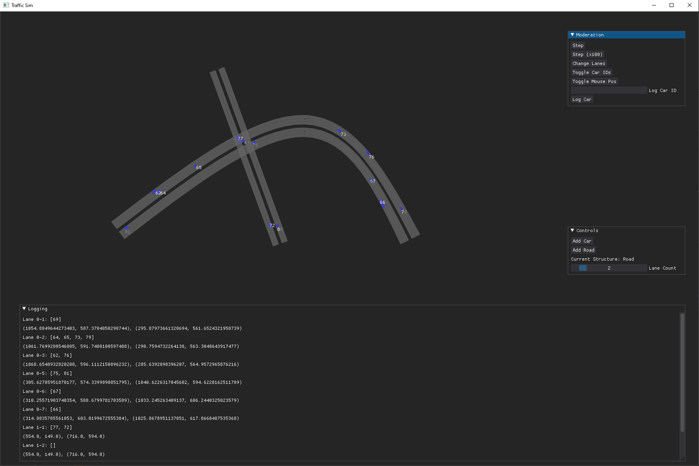

# Traffic Sim

This project aims to answer many questions about traffic that I ponder while stuck in the notorious LA/OC traffic.

The eventual testing will be approached from a "Mythbusters" perspective, targetting specific hunches such as:

* The slow lane moves faster than the fast lane in rush hour traffic

* Highway patrol are a significant factor in traffic without any stops/arrests being made

* Giving "sufficient room" actually increases traffic

* Speeding up to let a driver merge behind is better than slowing down to let them merge ahead

... and other questions as they appear.

## Usage

Run the file using `py window.py -i` to run in interactive mode. Currently development is focused on interactive mode, so the static scenario usage case may not function properly at the present moment.

Use the _Draw Road_ button and click on the canvas to place the path for a road. Click twice in one spot to terminate the road. The number of lanes can be adjusted using the slider, and the map can be moved around using the arrow keys. _'A'_ and _'D'_ cycle through the various placeable object types, but they currently all function as roads.

## Current Working Product

Traffic moves across lanes with periodically spawning cars that change lanes occasionally. Contains basic logging functionality to view car numbers and information about specific cars such as their kinematic and simulation information.

My ongoing notes and resources for this project can be viewed at [this](https://docs.google.com/document/d/1w3tQln8fmIwiUt_5-y6z8YQ2vCFQgLFo0PGCv-kFzDc/edit?usp=sharing) Google Docs link.

## TODO:

* Road merges

* Lights & signs

* ~~Curving roads~~ - Partially working

* More involved car generation
    * Driver agents
    * Car classes

* Crash/accident logging

* Dynamic speed limits

* ~~Simplified system for defining road architectures~~ - Interactive definition!
    * Non-reliant on the visualization
    * Potentially a list of unit vectors, lengths, and start points